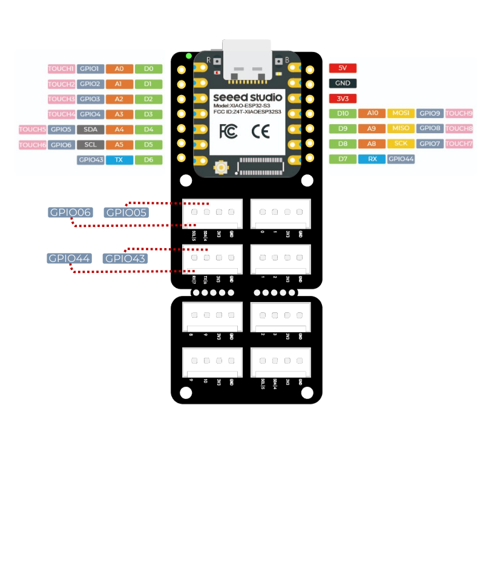
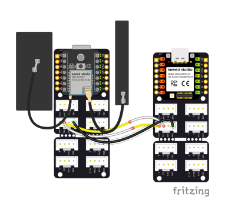
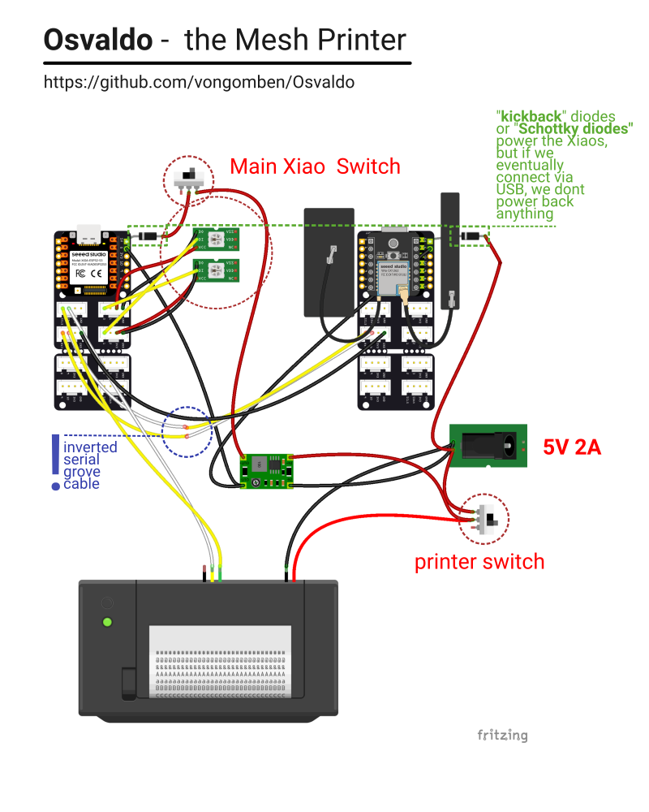

# Osvaldo
Osvaldo is aimed to make ethreal messages physical, from the meshiverse 

It all stems from **[a thought](https://www.reddit.com/r/meshtastic/comments/1d07e7j/meshtastic_thermal_printer_ticker_tape_node/) I had a year ago: how to save and somehow record these ephemeral-ethereal messages in our absence?**

Attach a printer to a meshtastic radio and see the messages coming one after another, a real physical representation of the conversations.

This project was an excuse to see how far a meshtastic radio could be integrated into a more distributed and complex system. 

A number of things can be built from here, including - in addition to the printer from which we start - **a small bot capable of field operations**, or even **a very simple BBS** (Bulletin board system) **based on microntrollers**. 

The idea of the printer is itself an hommage to the [Little Printer from Berg](https://www.failory.com/cemetery/berg) 

<iframe width="560" height="315" src="https://www.youtube.com/embed/IlC5taBgLp0?si=3HXCBTyb_Gr8--oA" frameborder="0" allow="accelerometer; autoplay; clipboard-write; encrypted-media; gyroscope; picture-in-picture" allowfullscreen></iframe>

As for the Meshbot, this project updates several ideas and limits and scenarios in a new way. 
We are not making "printer of the internet", you could easily do that in many other ways-
Osvaldo is not even connected to the internet (and for this reason, I guess it doesn't event know the time and date). 
Osvaldo is connected to the Mesh. 

He receives messages and prints them. 
I could possibly add many features to this, which is an ongoing project. 
One is the Battery, maybe even solar powered. 
Another is exposing a Captive Portal that allows you to control Osvaldo via the phone (wifi): eyes (colours), texts, QR code of the Meshtastic Channel Osvaldo is listening to.

The future holds many challenges in front of us, lets see. 

### But What is Osvaldo doing right now?

- Osvaldo is a node in the Mesh
- Prints the received messages and make some funny LED patterns

### Hardware

- a meshtastic radio (I am using a [XIAO ESP32S3 & Wio-SX1262 Kit for Meshtastic & LoRa](https://www.seeedstudio.com/Wio-SX1262-with-XIAO-ESP32S3-p-5982.html?)
- a second radio from which to send data (paired with a cell phone)
- a microcontroller (Xiao ESP32S3)
- a voltage converter
- 2 switches (I want to be able to turn off the printer and possibly turn off the Xiao ESP32S3 managing the LEDS & printer behaviours)
- a strip of WS2812 LEDs
- 2 kikcback diodes (or Schottky diodes) because we will need to access both boards (the xiao-radio and tha xiao that manages the printer) without powering up the rest / interfere with the circuits. 
- two [Xiao Grove Shields](https://wiki.seeedstudio.com/Grove-Shield-for-Seeeduino-XIAO-embedded-battery-management-chip/) (for purely educational purposes - I'm getting old. You can skip them if you want to make you project tynier and save money. 

### Software side, we use:
- [meshtastic web flasher](https://flasher.meshtastic.org/)
- [meshtastic console](https://client.meshtastic.org/)
- [Arduino IDE with ESP32 core](https://wiki.seeedstudio.com/xiao_esp32s3_getting_started/#software-preparation)
- [Meshtastic's Protobuf library for Arduino](https://github.com/meshtastic/Meshtastic-arduino)
- [Adafruit Thermal Printer Library](https://github.com/adafruit/Adafruit-Thermal-Printer-Library) 

## 1) Flashing Radio n° 1

Visit [meshtastic web flasher](https://flasher.meshtastic.org/) and follow the instructions. 

## 2) Configuring the Radio

While you can go on from here using the Android or iOS app, I'll stick with the [meshtastic console](https://client.meshtastic.org/). 
We are going to **define its Serial pins** (based on Xiao's pin mapping) and **enable protobuf communication**. 

Since I'm using the [Xiao Grove Shields](https://wiki.seeedstudio.com/Grove-Shield-for-Seeeduino-XIAO-embedded-battery-management-chip/) I'm also sharing this useful image of the pin mapping. 

## 3) Listening to the Serial Port using Protobuf from another Xiao

Let's connect the two boards in this way. 
Important TX is going to RX, and viceversa. Do not connect 3V3 for now. 

In order to have a cable for the serial communication I changed a grove connector making it usable changing TX to RX and vice versa. 

After installed the library, we can run this code in order to read whichever is passing via the serial and read all the nodes received in the serial port. Don't worry: we are going to fine tune this code in order to do less.

## 4) Let's attach the priter!

Hook up the printer following these instructions

## 5) Print and assemble Osvaldo

I have used some trasparent PLA to create the eyes. Inside I've put the LEDs. 
Nice. 
You can find the stl files of this version in the folder. You should print "eye-cover.stl" in transparent PLA. All the rest is up to you for color or material.  

You have to solder the LEDs in order to make them stay in the eye. 

##  Test Osvaldo

Before connecting Osvaldo to the Mesh we have to test if it's printing and the LEDs are working:
- Check the LEDs
- Check the Printer

